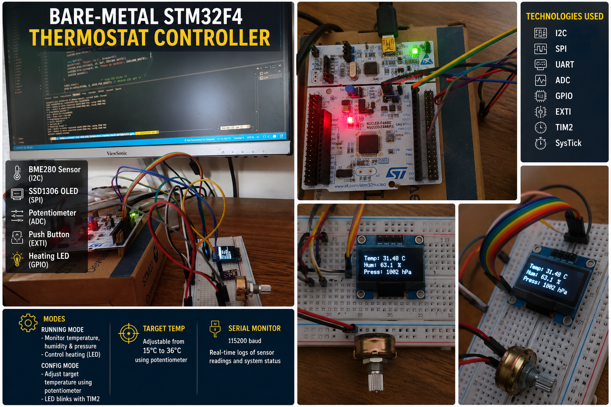

# Bare-Metal STM32F4 Thermostat Controller

A bare-metal thermostat controller built in **C for the STM32F4** microcontroller family.

The project combines a **BME280 environmental sensor**, **SSD1306 OLED display**, **potentiometer**, **push button**, and **LED output** to implement a simple embedded thermostat controller without an RTOS or high-level hardware abstraction framework.

The firmware directly configures and controls STM32 peripherals at the register level, making the project a practical example of low-level embedded development.

---



## Overview

The thermostat operates in two modes:

### RUNNING Mode

The controller continuously:

* Reads temperature, humidity, and pressure from the BME280.
* Displays the measurements on the SSD1306 OLED.
* Compares the measured temperature against the configured target.
* Activates the heating output when the temperature is below the target.
* Reports system status and measurements through UART.

### CONFIG Mode

The user can press the push button to enter configuration mode.

In CONFIG mode:

* The potentiometer controls the target temperature.
* The selected setpoint is displayed on the OLED.
* The LED provides visual feedback through timer-driven blinking.
* Pressing the button again returns the system to RUNNING mode.

The target temperature can be adjusted between **15°C and 36°C**.

---

## Hardware

The project was developed around the **NUCLEO-F446RE** development board.

### Components

* STM32F446RE / NUCLEO-F446RE
* BME280 temperature, humidity and pressure sensor
* SSD1306 128×64 monochrome OLED
* Potentiometer
* Push button
* On-board LED
* USB connection through the Nucleo ST-LINK interface

---

## Communication Interfaces

The project demonstrates several common embedded communication and peripheral interfaces.

| Peripheral  | Purpose                       |
| ----------- | ----------------------------- |
| **I²C1**    | BME280 communication          |
| **SPI2**    | SSD1306 OLED communication    |
| **USART2**  | Serial logging and debugging  |
| **ADC1**    | Potentiometer input           |
| **GPIO**    | LED and control signals       |
| **EXTI**    | Push-button interrupt         |
| **TIM2**    | Periodic LED blinking         |
| **SysTick** | Millisecond timing and delays |

### BME280 — I²C

The BME280 communicates with the MCU using **I²C**.

The driver handles sensor initialization, calibration data, and measurement acquisition.

The application uses the sensor to obtain:

* Temperature
* Relative humidity
* Atmospheric pressure

### SSD1306 — SPI

The OLED uses **SPI** for display communication.

The firmware maintains a **128×64 framebuffer** and sends the framebuffer to the SSD1306 controller when the display is updated.

The display driver also provides basic drawing primitives such as:

* Pixels
* Characters
* Strings
* Horizontal/vertical lines
* Rectangles
* Filled rectangles

### UART

USART2 is used for debugging and runtime monitoring at:

```text
115200 baud
```

Example output:

```text
=== Thermostat started ===

Temperature: 31.48 C
Pressure: 1002.72 hPa
Humidity: 63.19 %RH
```

---

## Software Architecture

The project is intentionally structured into small hardware drivers and application logic.

```text
.
├── drivers/
│   ├── adc.c/.h
│   ├── bme280.c/.h
│   ├── gpio.c/.h
│   ├── i2c.c/.h
│   ├── spi.c/.h
│   ├── ssd1306.c/.h
│   ├── systick.c/.h
│   ├── timer.c/.h
│   └── uart.c/.h
│
├── helpers/
│   ├── CMSIS/
│   └── ST/
│
├── main.c
├── Makefile
└── README.md
```

### Driver Layer

The driver layer handles direct interaction with STM32 peripherals and external devices.

For example:

```text
BME280 driver
     ↓
I²C driver
     ↓
STM32 I²C1 registers
```

and:

```text
SSD1306 driver
     ↓
SPI driver
     ↓
STM32 SPI2 registers
```

The application layer does not need to deal with individual peripheral registers for every sensor/display operation.

---

## Application Flow

The main application follows a simple state-machine approach:

```text
                 ┌───────────────┐
                 │    STARTUP    │
                 └───────┬───────┘
                         │
                         ▼
                Initialize peripherals
                         │
                         ▼
                 ┌───────────────┐
          ┌──────│    RUNNING    │──────┐
          │      └───────────────┘      │
          │              │              │
          │              │ Button       │
          │              ▼              │
          │      ┌───────────────┐      │
          └──────│     CONFIG    │──────┘
                 └───────────────┘
                         │
                         ▼
                 Update setpoint
                 using potentiometer
```

---

## Thermostat Logic

The heating decision is intentionally simple:

```text
if measured_temperature < target_temperature
        heating = ON
else
        heating = OFF
```

The heating state is represented by the MCU's GPIO-controlled LED in this implementation.

This keeps the project focused on the embedded control architecture while leaving the actual power-stage/heater implementation as a future hardware extension.

---

## Configuration

The default target temperature is:

```text
25°C
```

In CONFIG mode, the potentiometer is converted through the ADC and mapped to:

```text
15°C → 36°C
```

The setpoint is retained when returning to RUNNING mode.

---

## Timing and Interrupts

The project uses **SysTick** for millisecond timing and delays.

**TIM2** is used for periodic LED blinking while the system is in CONFIG mode.

The user button is handled using:

```text
PC13 → EXTI13
```

A software debounce period prevents multiple state transitions caused by a single button press.

This gives the project practical experience with both **polling-based application logic** and **interrupt-driven events**.

---

## Bare-Metal Approach

No RTOS is used.

The firmware directly configures STM32 peripheral registers for:

* GPIO
* I²C
* SPI
* USART
* ADC
* TIM2
* EXTI
* SysTick

For example, peripheral clocks, GPIO modes, alternate functions, SPI configuration, and interrupt configuration are explicitly controlled by the firmware.

This makes the project useful for understanding what happens underneath higher-level embedded frameworks.

---

## Build Requirements

You need:

* `arm-none-eabi-gcc`
* `arm-none-eabi-as`
* `arm-none-eabi-objcopy`
* GNU Make
* OpenOCD
* ST-LINK

Verify the ARM toolchain:

```bash
arm-none-eabi-gcc --version
```

Verify OpenOCD:

```bash
openocd --version
```

---

## Build

Clone the repository and enter the project directory:

```bash
git clone <repository-url>
cd bare-metal-thermostat
```

Build:

```bash
make clean
make all
```

The Makefile generates the firmware image required for programming the MCU.

---

## Flash

Connect the NUCLEO-F446RE to the computer through USB and run:

```bash
make flash
```

The project uses the Nucleo's onboard ST-LINK interface for programming and debugging.

---

## Serial Monitoring

On Linux, identify the ST-LINK Virtual COM Port:

```bash
ls /dev/ttyACM*
```

For example:

```text
/dev/ttyACM0
```

Open the serial terminal:

```bash
screen /dev/ttyACM0 115200
```

The firmware outputs sensor measurements and application events through USART2.

---

## Example

A typical runtime display looks conceptually like:

```text
┌──────────────────────┐
│      THERMOSTAT      │
│                      │
│ Temp:  31.48 C       │
│ Hum:   63.1 %        │
│ Press: 1002 hPa      │
│                      │
└──────────────────────┘
```

When the measured temperature falls below the configured target, the heating indicator is activated.

---

## What This Project Demonstrates

This project is intended as a practical embedded-systems exercise rather than simply a sensor demo.

It covers:

* Bare-metal ARM Cortex-M programming
* STM32 register-level peripheral configuration
* Embedded C
* I²C device communication
* SPI device communication
* UART debugging
* ADC sampling
* GPIO control
* External interrupts
* Timer interrupts
* SysTick-based timing
* OLED framebuffer management
* Sensor calibration and compensation
* Simple embedded state-machine design
* Hardware/software integration
* GNU Make build systems
* OpenOCD/ST-LINK programming

---

## Future Improvements

Possible extensions include:

* Replace the LED with a real heater control stage
* Add hysteresis to prevent rapid heater switching
* Add a MOSFET/relay output with appropriate protection
* Add EEPROM/Flash storage for persistent setpoints
* Add low-power/sleep modes
* Add fault detection for sensor communication failures
* Add BME280 timeout/error handling
* Add graphical temperature trends
* Add min/max temperature tracking
* Add a rotary encoder instead of the potentiometer
* Add an alarm for over-temperature conditions
* Add a more formal event/state-machine architecture

---

## Project Status

**Status: Functional prototype**

The project demonstrates the complete embedded control flow from sensor acquisition to display, user configuration, control output, and serial diagnostics.

It is intended primarily as a **bare-metal STM32 learning and portfolio project** demonstrating low-level peripheral programming and integration of multiple hardware interfaces.
